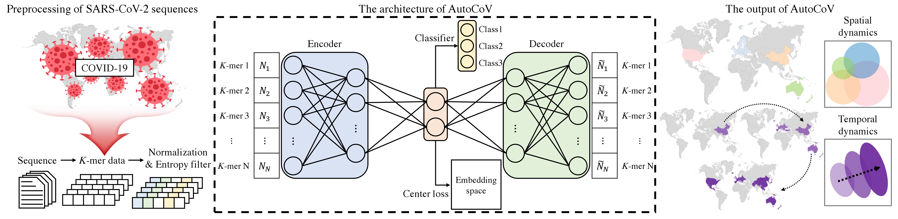
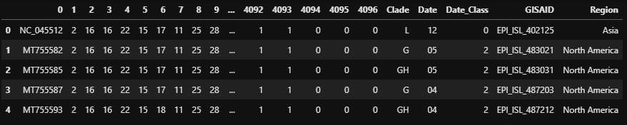

# AutoCoV: Learning the Spatial and Temporal Dynamics of COVID-19 Spread Patterns from Embedding Space by k-mer Based Deep Learning

<p align="center"></p>

<h2 align="left">Usage</h2>

```bash
# Run AutoCoV with training, validation, test data.
python run.py train.txt val.txt test.txt
```

## Input Example
Input data is `sequence x feature` matrix and the example is below. 
<p align="center"></p>
In feature dimension, it consits of following information.
- abc
- ded
- edf
