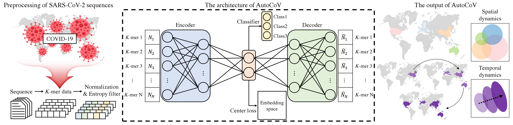
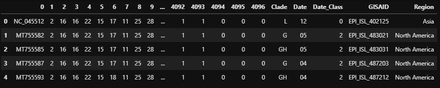

# AutoCoV: Learning the Spatial and Temporal Dynamics of COVID-19 Spread Patterns from Embedding Space by k-mer Based Deep Learning

<p align="center"></p>

<h2 align="left">Usage</h2>

```bash
# Run AutoCoV with training, validation, test data.
python run.py train.txt val.txt test.txt
```

## Input Example
Input data is `sequence x feature` matrix and the example is below. 
<p align="center"></p>
In feature dimension, it consits of following information.

```
- [Column 1] Sequence ID (NCBI): It will be used as index of data.
- [Column 2 ~ N] K-mer feature: the frequencies of each k-mer.
- [Column N+1 ~ N+5] Virus Information.
  - Clade: subclass information of the virus.
  - Date: month of the virus collected.
  - Date_Class: {0, 1, 2} where 0 for Dec 2019, Jan, Fed 2020 / 1 for Mar 2020/ 2 for from Apr 2020.
  - GISAID: Sequence ID from GISAID. If not available, fill 'None'.
  - Region: location of the virus collected.
```
